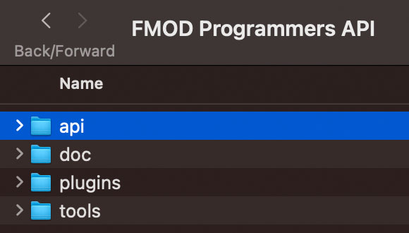
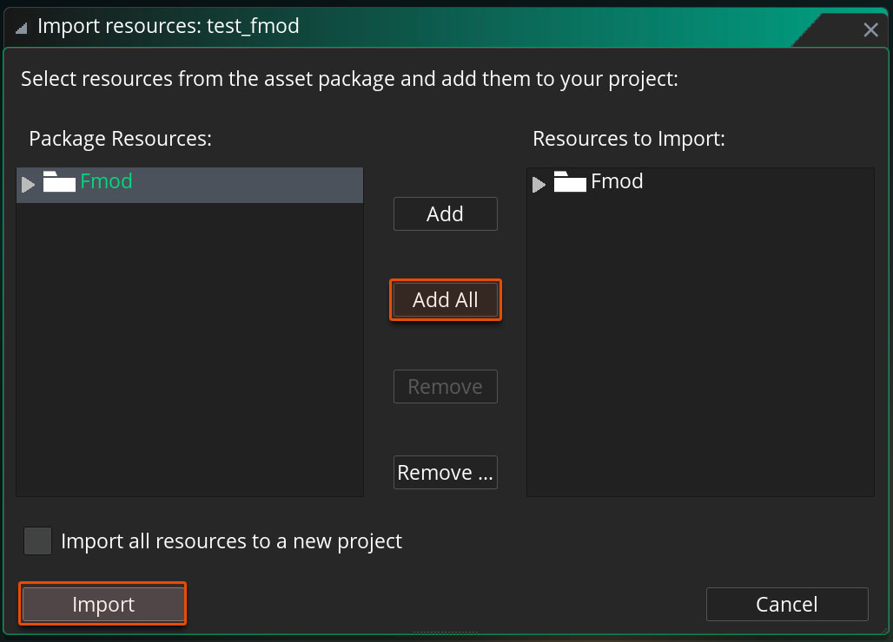

@title Getting Started with FMOD in GameMaker

# Setting Up FMOD

Go to [FMOD Downloads](https://www.fmod.com/download).

Download **FMOD Studio** and **FMOD Engine**. As of writing this guide, the latest version is 2.02.20, which is supported.

For **Studio**, download the package for the platform you are developing on.

For **Engine**, download packages for the platforms you want to publish your game to.

After installing the Engine API, open the installation and remember the location of the "api" folder:

# Setting Up GameMaker

Download the latest package from the [Releases page](https://github.com/YoYoGames/GMEXT-FMOD/releases) of this repository.

Open your GameMaker project or create a new one.

Drag the .yymps file from the downloaded package into your GameMaker window, or go into **Tools -> Import Local Package** to select the .yymps file.

In the window that opens, select **Add All** and then **Import**.

In your Asset Browser, expand the "Fmod" folder, expand "Extensions", and double-click on **FMOD**.

This will open the Extension Editor which contains the extension's parameters.

The parameters you need to set are the SDK locations for the platforms the game will be exported to. This needs the location of the "api" folder in the FMOD Engine directory.

Here the Mac API is entered as the IDE is running on a Mac. Use the Browse [...] button to find and select your FMOD Engine's "api" folder.

FMOD set-up is now complete. Let's look at how you can import banks from your FMOD Project and play events.

# Playing Events
